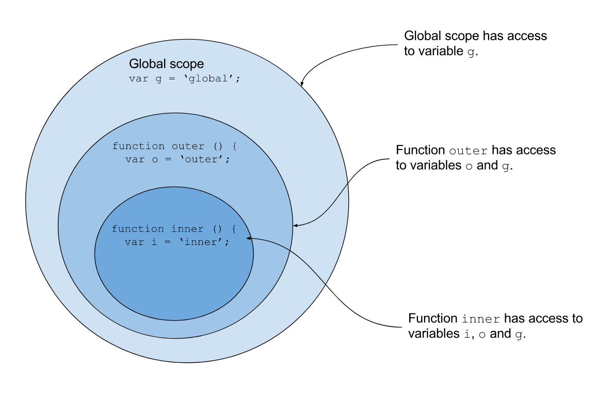

# Getting started

## Installation

Install peer dependencies:
`npm install @apoyo/std`

Install package:
`npm install @apoyo/scopes`

## Motivation

Today, a lot of solutions exists for dependency injection in JS/TS, the most popular solutions being:

- Typedi
- Inversify
- Nestjs
- etc...

There are however a few issues:

- They are mostly used with classes and decorators

- They don't support custom scopes creation: Most only have a singleton scope, transient scope and maybe request scope

- Most of them don't have a clear shutdown mechanism, to gracefully shutdown the services

## Goal

This package is a more functional based dependency injection solution, with the following characteristics:

- Without classes / decorators: This encourages better code splitting, and makes it a lot easier to expose primitives, async values, functions, etc... instead of mostly class instances only. It also encourages composition.

- Typescript friendly

- Custom scopes: You will have complete control over how many scopes and child scopes you create. This makes it very easy to create, for example, a separate scope for each "Job", containing the data of the job that is being currently processed.

- Lazy loading: If your application contains hundreds of services, why should we start them all up if only a handful are needed on program startup?

- Powerful scope shutdown mechanism: In production environments, we most probably want to shutdown our application properly before restarting it (example: Wait for current HTTP requests to finish, then close server, then close database connection, etc...)

- Easier testability

## Injectables

In most IOCs, we mostly use classes to define our services / repositories / etc...

In this library, an injectable is simply a wrapper that can contain **any variable** you need:

- Class instances
- Functions / Async functions
- Values / Async values
- etc...

As such, we will refer to these as "*Injectable variables*".
All functions for creating and managing these are available in the `Var` namespace.

### Create an injectable variable

There are multiple ways to create an injectable variable.

1. From a constant:

```ts
const MockConfig = Var.of<Config>({
  api: {
    port: 3000
  }
})
```

These may be used to mock injectables.

2. From a function without any parameters (without any dependencies):

```ts
const Env = Var.thunk(async () => {
  // This function may also be asynchroneous
  // Load env
  return process.env
})
```

These may be used to create injectables **that do not depend** on any other injectable.
Another advantage compared to `Var.of` is that `Var.thunk` is lazy, and will only execute the function if the injectable is required / loaded.

3. As an abstract value:

```ts
interface ILogger {
  log(message: string): void
}

const ILogger = Var.abstract<ILogger>("ILogger")
```

There are a lot of use-cases where it is useful to write code for a given interface instead of an implementation. `Var.abstract` can be used to cover for this situation.

**Warning**: You will need to **bind** this abstract injectable to a specific value, or to another implemented injectable when creating a scope, or you will receive a **runtime error** when this abstract injectable is loaded.

It is also possible to specify a default implementation to use for this abstract injectable:

```ts
interface ILogger {
  log(message: string): void
}

const NoopLogger = Var.of<ILogger>({
  log: (_message: string) => {}
})

const ILogger = pipe(
  Var.abstract<ILogger>("ILogger"),
  Var.default(NoopLogger)
)
```

### Creating injectables based on other injectables

Most of the time, you will need to create injectable variables based on other injectables.

For those situations, you will need to use `Var.map`:

```ts
const Config = pipe(
  Env,
  Var.map(env => {
    return {
      api: {
        port: env.API_PORT
      }
    }
  })
)
```

`Var.map` allows us create a new injectable `Var<B>` from an injectable `Var<A>`.

If you require multiple dependencies, you have 2 possibilities:

1. You can use `Var.struct` to combine multiple injectable variables into a single variable. This single variable can then be mapped:

```ts
const A = Var.of(1)
const B = Var.of(2)

const C = pipe(
  Var.struct({
    a: A,
    b: B
  }),
  Var.map(({ a, b }) => a + b)
)
```

2. You can use `Var.tuple` to combine multiple injectable variables into a single tuple. This single variable can then be mapped:

```ts
const A = Var.of(1)
const B = Var.of(2)

const add = (a: number, b: number) => a + b

const C = pipe(
  Var.tuple(A, B),
  Var.map(([a, b]) => add(a, b))
)
```

As it may become cumbersome to "untuple" the parameters of your function, you may also want to use `Var.mapArgs` in conjunction with `Var.tuple`. This allows you to more easily extract logic into a separate function:

```ts
const C = pipe(
  Var.tuple(A, B),
  Var.mapArgs(add)
)
```

### Creating a disposable variable

Sometimes, you may want to create a variable that needs to be closed / disposed when it is not used anymore.

*Example: Database connections, Http servers, etc...*

This type of variable can be created in the following way:

```ts
const Api = pipe(
  Var.struct({
    config: ApiConfig
  }),
  Var.resource(({ config }) => {

    const app = express()

    const server = app.listen(config.port)

    const close = async () => {
      return new Promise((resolve, reject) => {
        server.close((err) => err ? reject(err) : resolve(err))
      })
    }

    return Resource.of(app, close)
  })
)
```

**Note**: The variable will only be disposed when the scope into which the variable has been mounted is closed.

### Switching between multiple injectables

Sometimes, we may want to dynamically switch between multiple implementations based on another injectable.
In those cases, you may use `Var.chain`:

```ts
const FileProvider = pipe(
  Env,
  Var.chain(env => {
    const provider = env.FILE_PROVIDER
    if (provider === 'aws') return S3FileProvider
    if (provider === 'azure') return AzureFileProvider 
    throw new Error(`Unimplemented file provider ${JSON.stringify(provider)}`)
  })
)
```

**Note**: Variables that are not returned are not loaded. As such, this operation is more efficient than loading all injectables and switching on their values.

### Dynamically create an injectable

Abstracts help you create injectables for a specific interface. This also means that it can only have 1 implementation at a time.

Sometimes, you may need to create multiple injectables per scope depending on a dynamic value.
In this case, you can simply create a function returning a new injectable:

```ts
const forParam = (name: string) => pipe(
  Request,
  Var.map(req => req.params[name])
)

const Params = {
  Id: forParam('id'), // Var<string>
  Slug: forParam('slug') // Var<string>
}
```

**Note**: Each injectable has his own "reference". If you call the same function `forParam` twice with the same parameters, it will return 2 different injectables. This means that those injectable will be re-computed when called.

## Scopes / Containers

A scope contains all injectable variables that have been loaded until now. As such, a scope is very similar to the "Container" implementation you may know from other libraries.

There are however a few big differences:

- You may only re-bind / mock injectables when creating the scope.

- Once the scope has been created, it is not possible to change it anymore.

- A scope may have sub-scopes.

- ... and a few more that we will cover later.

In fact, this dependency injector has heavily inspired itself from how Javascript scopes work:



### Creating a scope

TODO

### Creating a sub-scope

TODO

### In which scope is a variable mounted?

The library will **automatically deduce** into which scope your injectable variable needs to be **declared** / **mounted**, depending on it's dependencies:

- A variable will always try to mount in the highest scope possible:
  - *Example: If the variable does not have any dependencies, it will always be mounted in the root scope.*

- A variable will always be mounted at the scope of the dependency with the lowest scope:
  - *Example: If the variable has 2 dependencies A and B, with A being in the root scope and B in a sub-scope of root ("request"), the variable will be mounted in the request scope.*

### Closing a scope

TODO

## Example

**Note**: The entire source code of the examples will be available under the *examples/scopes* folder.

### Declare variables

First, we will need to declare some `Var`s:

```ts

// This injectable does not have any dependencies. As such we simply use `Var.thunk`
const Env = Var.thunk(async () => {
  // Load env variables from .env files
  // Validate env variables
  // etc...
  return {
    PORT: parseInt(process.PORT) || 3000
  }
})

const Config = {
  API: pipe(
    Env,
    Var.map(env => ({
      port: env.PORT
    }))
  )
}

const HealthRoutes = pipe(
  Var.empty,
  Var.map(() => {
    const route = Router()

    route.get('/', (req, res) => {
      res.json({
        status: 'OK'
      })
    })

    return route
  })
)

const TodoRoutes = pipe(
  Var.empty,
  Var.map(() => {
    const route = Router()

    route.get('/', (req, res) => {
      res.json([
        {
          id: 1,
          title: 'Eat breakfast',
          done: false
        },
        {
          id: 2,
          title: 'Go to work',
          done: false
        }
      ])
    })

    return route
  })
)

export const Routes = pipe(
  Var.struct({
    health: HealthRoutes,
    todos: TodoRoutes
  }),
  Var.map((routes) => {
    const route = Router()
    route.use('/health', routes.health)
    route.use('/todos', routes.todos)
    return route
  })
)

const API = pipe(
  Var.struct({
    config: Config.API, 
    routes: Routes
  }),
  Var.resource(async ({ config, routes }) => {

    const app = express()
    // use middlewares
    // ...
    // use routes
    app.use(routes)

    const port = config.port
    const server = await new Promise((resolve, reject) => {
      const server = app.listen(port, (err) => err ? reject(err) : resolve(server))
    })

    const close = async () => {
      return new Promise((resolve, reject) => {
        server.close((err) => err ? reject(err) : resolve(err))
      })
    }

    return Resource.of(server, close)
  })
)
```

Once all the variables you need have been created, you need to create a scope that will host / manage these variables for you.

### Create a scope and loading our variables

```ts
const main = async () => {
  const scope = Scope.create({
    bindings: []
  })
  
  try {
    await scope.get(API)

    // It is recommended to add logic to await the end of the process and close the server gracefully.
    // Check out the examples for an example implementation.
  } catch (err) {
    await scope.close()
    throw err
  }
}

main()
```

That's it. Now, when you start your application, a scope will be created which will load an express server, including all required dependencies.
